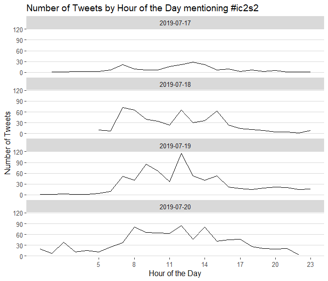
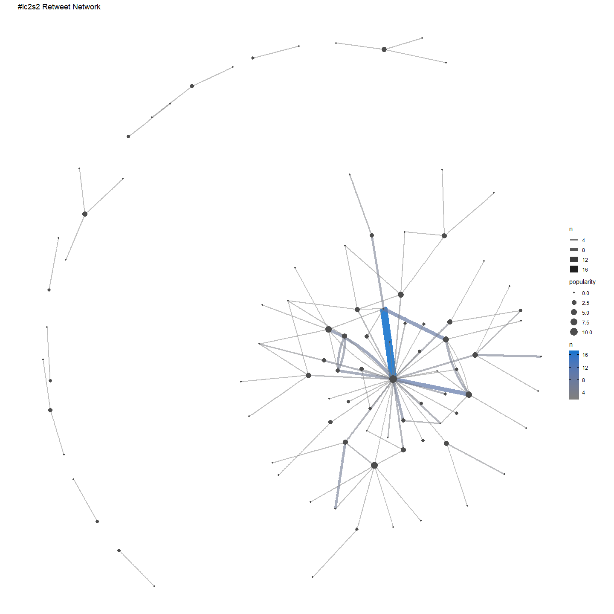
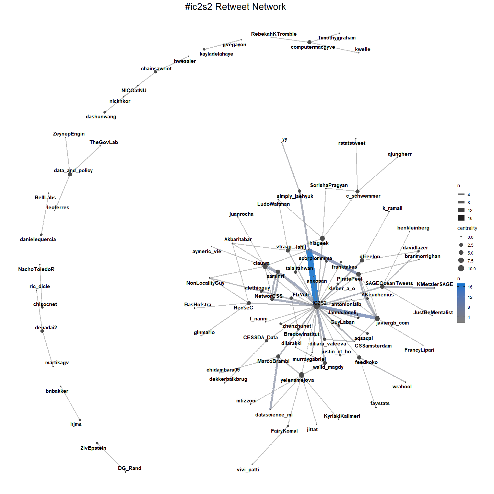
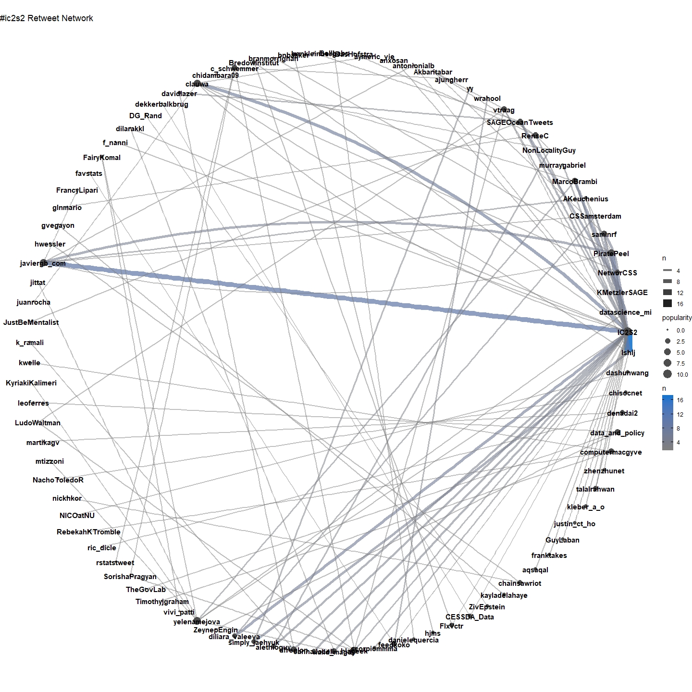
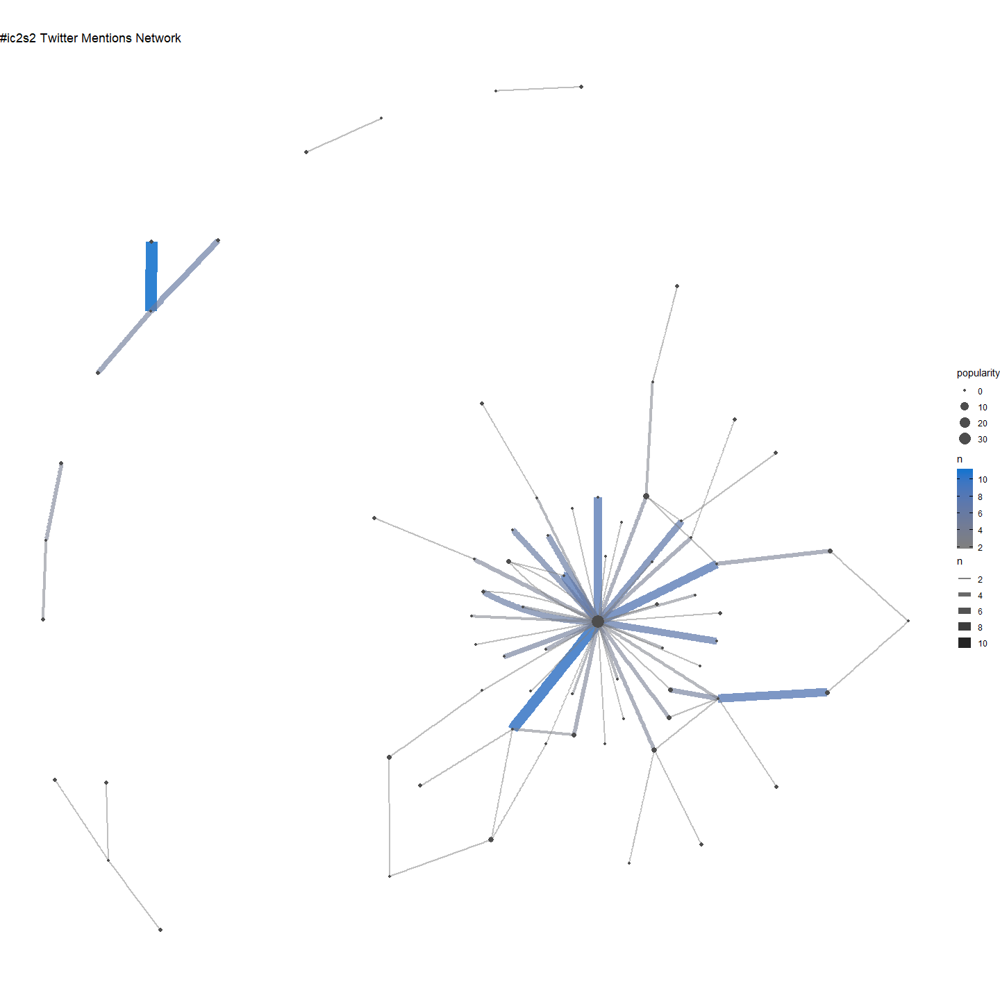
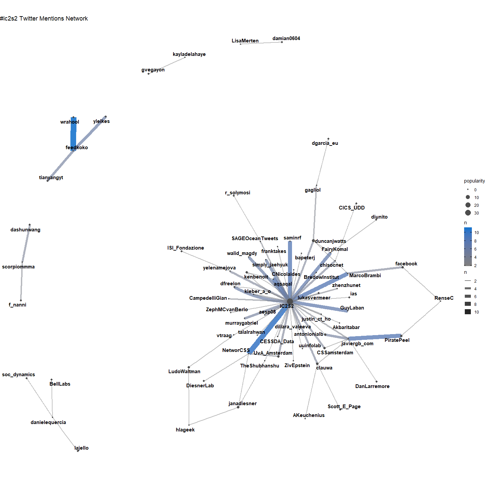
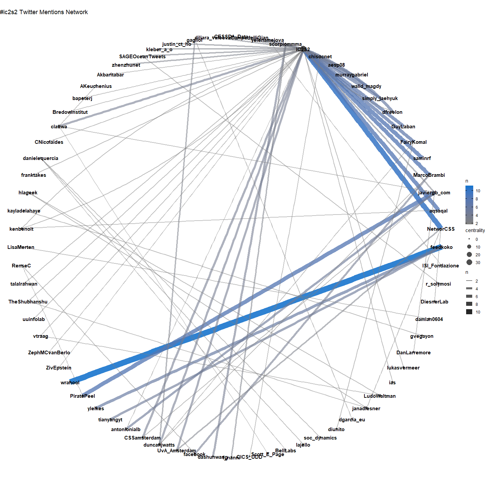
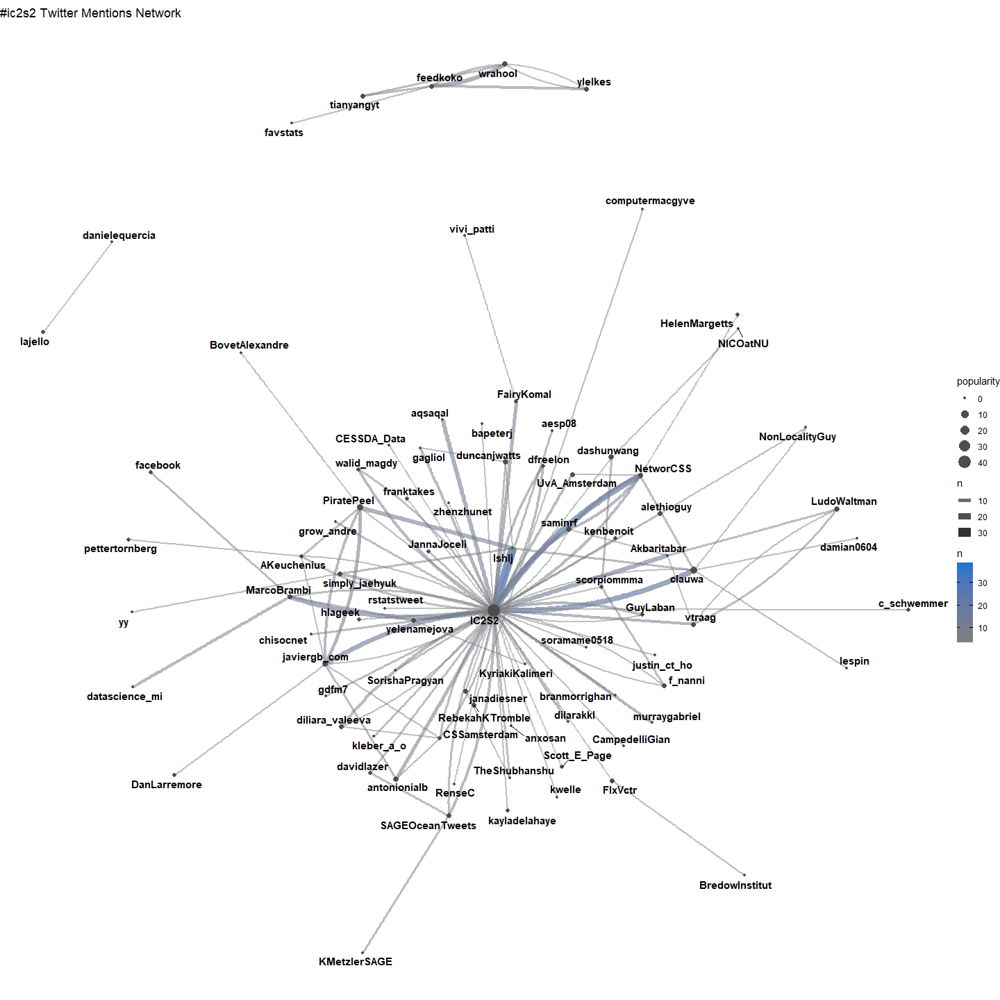
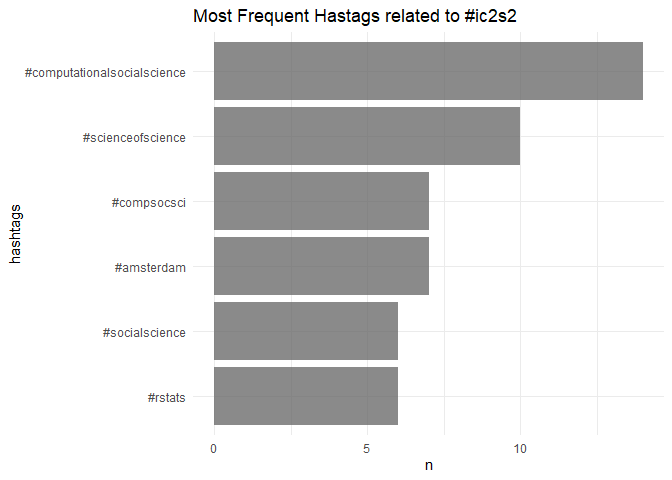

IC2S2 Twitter Analysis
================
Fabio
2019-07-21

This is a short notebook outlining the code used to scrape tweets
related to the IC2S2 conference in Amsterdam.

## Packages

Load the necessary packages

``` r
# install pacman once if not avaible on your machine
# install.packages("pacman")

pacman::p_load(tidyverse, rtweet, ggraph, igraph, tidygraph)
```

## Get Data

Call Twitter API. If you want to get data yourself you have to register
with a free account where you get your personal access point to Twitter.
Check out [`rtweet`](https://github.com/mkearney/rtweet/) and follow the
instructions.

``` r
# twitter_token <- readRDS("twitter_token.rds")

rt <- search_tweets(
  "#ic2s2 OR #IC2S2", n = 5000, include_rts = T, retryonratelimit = T
)

save(rt, file = "data/rt.Rdata")
```

Lets first look at the data structure and column names. Twitter returns
over 1,200 unique tweets.

``` r
load("data/rt.Rdata")

rt %>% glimpse # the same as str, returns a df overview
```

    ## Observations: 2,438
    ## Variables: 88
    ## $ user_id                 <chr> "375162961", "101206764", "1374422898", …
    ## $ status_id               <chr> "1152701093530542080", "1152701045413490…
    ## $ created_at              <dttm> 2019-07-20 22:05:31, 2019-07-20 22:05:2…
    ## $ screen_name             <chr> "TyphonBaalAmmon", "andy_nobes", "tendon…
    ## $ text                    <chr> "Duncan Watts - \"For 20 years I thought…
    ## $ source                  <chr> "Twitter Web App", "Twitter for Android"…
    ## $ display_text_width      <dbl> 140, 140, 140, 140, 140, 140, 140, 140, …
    ## $ reply_to_status_id      <chr> NA, NA, NA, NA, NA, NA, NA, NA, NA, NA, …
    ## $ reply_to_user_id        <chr> NA, NA, NA, NA, NA, NA, NA, NA, NA, NA, …
    ## $ reply_to_screen_name    <chr> NA, NA, NA, NA, NA, NA, NA, NA, NA, NA, …
    ## $ is_quote                <lgl> FALSE, FALSE, FALSE, FALSE, FALSE, FALSE…
    ## $ is_retweet              <lgl> TRUE, TRUE, TRUE, TRUE, TRUE, TRUE, TRUE…
    ## $ favorite_count          <int> 0, 0, 0, 0, 0, 0, 0, 0, 0, 0, 1, 3, 0, 0…
    ## $ retweet_count           <int> 595, 595, 595, 595, 595, 595, 595, 595, …
    ## $ hashtags                <list> [NA, NA, NA, NA, NA, NA, NA, NA, NA, NA…
    ## $ symbols                 <list> [NA, NA, NA, NA, NA, NA, NA, NA, NA, NA…
    ## $ urls_url                <list> [NA, NA, NA, NA, NA, NA, NA, NA, NA, NA…
    ## $ urls_t.co               <list> [NA, NA, NA, NA, NA, NA, NA, NA, NA, NA…
    ## $ urls_expanded_url       <list> [NA, NA, NA, NA, NA, NA, NA, NA, NA, NA…
    ## $ media_url               <list> [NA, NA, NA, NA, NA, NA, NA, NA, NA, NA…
    ## $ media_t.co              <list> [NA, NA, NA, NA, NA, NA, NA, NA, NA, NA…
    ## $ media_expanded_url      <list> [NA, NA, NA, NA, NA, NA, NA, NA, NA, NA…
    ## $ media_type              <list> [NA, NA, NA, NA, NA, NA, NA, NA, NA, NA…
    ## $ ext_media_url           <list> [NA, NA, NA, NA, NA, NA, NA, NA, NA, NA…
    ## $ ext_media_t.co          <list> [NA, NA, NA, NA, NA, NA, NA, NA, NA, NA…
    ## $ ext_media_expanded_url  <list> [NA, NA, NA, NA, NA, NA, NA, NA, NA, NA…
    ## $ ext_media_type          <chr> NA, NA, NA, NA, NA, NA, NA, NA, NA, NA, …
    ## $ mentions_user_id        <list> ["1907378006", "1907378006", "190737800…
    ## $ mentions_screen_name    <list> ["g_r_richardson", "g_r_richardson", "g…
    ## $ lang                    <chr> "en", "en", "en", "en", "en", "en", "en"…
    ## $ quoted_status_id        <chr> NA, NA, NA, NA, NA, NA, NA, NA, NA, NA, …
    ## $ quoted_text             <chr> NA, NA, NA, NA, NA, NA, NA, NA, NA, NA, …
    ## $ quoted_created_at       <dttm> NA, NA, NA, NA, NA, NA, NA, NA, NA, NA,…
    ## $ quoted_source           <chr> NA, NA, NA, NA, NA, NA, NA, NA, NA, NA, …
    ## $ quoted_favorite_count   <int> NA, NA, NA, NA, NA, NA, NA, NA, NA, NA, …
    ## $ quoted_retweet_count    <int> NA, NA, NA, NA, NA, NA, NA, NA, NA, NA, …
    ## $ quoted_user_id          <chr> NA, NA, NA, NA, NA, NA, NA, NA, NA, NA, …
    ## $ quoted_screen_name      <chr> NA, NA, NA, NA, NA, NA, NA, NA, NA, NA, …
    ## $ quoted_name             <chr> NA, NA, NA, NA, NA, NA, NA, NA, NA, NA, …
    ## $ quoted_followers_count  <int> NA, NA, NA, NA, NA, NA, NA, NA, NA, NA, …
    ## $ quoted_friends_count    <int> NA, NA, NA, NA, NA, NA, NA, NA, NA, NA, …
    ## $ quoted_statuses_count   <int> NA, NA, NA, NA, NA, NA, NA, NA, NA, NA, …
    ## $ quoted_location         <chr> NA, NA, NA, NA, NA, NA, NA, NA, NA, NA, …
    ## $ quoted_description      <chr> NA, NA, NA, NA, NA, NA, NA, NA, NA, NA, …
    ## $ quoted_verified         <lgl> NA, NA, NA, NA, NA, NA, NA, NA, NA, NA, …
    ## $ retweet_status_id       <chr> "1152197162350067714", "1152197162350067…
    ## $ retweet_text            <chr> "Duncan Watts - \"For 20 years I thought…
    ## $ retweet_created_at      <dttm> 2019-07-19 12:43:04, 2019-07-19 12:43:0…
    ## $ retweet_source          <chr> "Twitter for Android", "Twitter for Andr…
    ## $ retweet_favorite_count  <int> 2194, 2194, 2194, 2194, 2194, 2194, 2194…
    ## $ retweet_retweet_count   <int> 595, 595, 595, 595, 595, 595, 595, 595, …
    ## $ retweet_user_id         <chr> "1907378006", "1907378006", "1907378006"…
    ## $ retweet_screen_name     <chr> "g_r_richardson", "g_r_richardson", "g_r…
    ## $ retweet_name            <chr> "George Richardson", "George Richardson"…
    ## $ retweet_followers_count <int> 621, 621, 621, 621, 621, 621, 621, 621, …
    ## $ retweet_friends_count   <int> 1114, 1114, 1114, 1114, 1114, 1114, 1114…
    ## $ retweet_statuses_count  <int> 924, 924, 924, 924, 924, 924, 924, 924, …
    ## $ retweet_location        <chr> "London", "London", "London", "London", …
    ## $ retweet_description     <chr> "Mapping innovation @nesta_uk. Podcast c…
    ## $ retweet_verified        <lgl> FALSE, FALSE, FALSE, FALSE, FALSE, FALSE…
    ## $ place_url               <chr> NA, NA, NA, NA, NA, NA, NA, NA, NA, NA, …
    ## $ place_name              <chr> NA, NA, NA, NA, NA, NA, NA, NA, NA, NA, …
    ## $ place_full_name         <chr> NA, NA, NA, NA, NA, NA, NA, NA, NA, NA, …
    ## $ place_type              <chr> NA, NA, NA, NA, NA, NA, NA, NA, NA, NA, …
    ## $ country                 <chr> NA, NA, NA, NA, NA, NA, NA, NA, NA, NA, …
    ## $ country_code            <chr> NA, NA, NA, NA, NA, NA, NA, NA, NA, NA, …
    ## $ geo_coords              <list> [<NA, NA>, <NA, NA>, <NA, NA>, <NA, NA>…
    ## $ coords_coords           <list> [<NA, NA>, <NA, NA>, <NA, NA>, <NA, NA>…
    ## $ bbox_coords             <list> [<NA, NA, NA, NA, NA, NA, NA, NA>, <NA,…
    ## $ status_url              <chr> "https://twitter.com/TyphonBaalAmmon/sta…
    ## $ name                    <chr> "Monsieur Teubax loves oud and Madame Te…
    ## $ location                <chr> "", "Didcot | Oxford | beyond...", "Univ…
    ## $ description             <chr> "Sur ce compte : <U+672C><U+97F3>, sciences du langage…
    ## $ url                     <chr> NA, "https://t.co/3Zfu6bskGd", "https://…
    ## $ protected               <lgl> FALSE, FALSE, FALSE, FALSE, FALSE, FALSE…
    ## $ followers_count         <int> 1335, 1716, 5227, 1834, 661, 1780, 7, 18…
    ## $ friends_count           <int> 829, 3455, 273, 1047, 550, 675, 290, 171…
    ## $ listed_count            <int> 74, 49, 77, 33, 6, 31, 0, 180, 2, 0, 2, …
    ## $ statuses_count          <int> 147013, 7475, 4572, 13145, 2465, 4755, 6…
    ## $ favourites_count        <int> 78258, 12181, 2613, 5123, 3543, 4604, 30…
    ## $ account_created_at      <dttm> 2011-09-17 16:26:35, 2010-01-02 12:07:2…
    ## $ verified                <lgl> FALSE, FALSE, FALSE, FALSE, FALSE, FALSE…
    ## $ profile_url             <chr> NA, "https://t.co/3Zfu6bskGd", "https://…
    ## $ profile_expanded_url    <chr> NA, "https://www.linkedin.com/in/andynob…
    ## $ account_lang            <lgl> NA, NA, NA, NA, NA, NA, NA, NA, NA, NA, …
    ## $ profile_banner_url      <chr> "https://pbs.twimg.com/profile_banners/3…
    ## $ profile_background_url  <chr> "http://abs.twimg.com/images/themes/them…
    ## $ profile_image_url       <chr> "http://pbs.twimg.com/profile_images/111…

The top ten retweeted tweets.

``` r
# load("rt.Rdata")
rt %>% 
  filter(!is_retweet) %>% 
  select(screen_name, text, retweet_count) %>% 
  filter(!str_detect(text, "^RT")) %>% 
  mutate(text = str_replace_all(text, "\\\n", " ")) %>% 
  arrange(desc(retweet_count)) %>% 
  top_n(n = 10) %>% 
  knitr::kable(., format = "markdown")
```

| screen\_name     | text                                                                                                                                                                                                                                                                                                                   | retweet\_count |
| :--------------- | :--------------------------------------------------------------------------------------------------------------------------------------------------------------------------------------------------------------------------------------------------------------------------------------------------------------------- | -------------: |
| g\_r\_richardson | Duncan Watts - “For 20 years I thought my job was as a basic scientist. Publish papers and throw them over the wall for someone else to apply. I now realise that there’s no one on the other side of the wall. Just a huge pile of papers that we’ve all thrown over.” \#IC2S2                                        |            595 |
| franktakes       | The scientific discipline migration network of 480 participants @IC2S2 2019 conference on computational social science @UvA\_Amsterdam, based on links (original-\>current) discipline, as entered upon registration. Size = weighted indegree. Color = weighted outdegree. \#IC2S2 <https://t.co/0pmLwttfWp>          |             48 |
| dashunwang       | special delivery for \#IC2S2 - our latest in Nature Human Behavior: <https://t.co/l1EYiHItNm> Five years in the making. Accompanied by my essay in @HarvardBiz: <https://t.co/EkZj238lZw> Findings may be relevant to a range of scholars, CSS, diffusion, \#ScienceOfScience thread \[1/n\] <https://t.co/h7LbpTXVBU> |             24 |
| RebekahKTromble  | 🚨🚨Hey, \#IC2S2. I’m looking for 2-3 postdocs for 2 projects at George Washington U. 1st is Twitter health metrics, primarily NLP. 2nd is mis/disinfo, comp methods wide ranging. Both start ASAP this fall. My DMs are temp open. Hit me up if you’d like to chat on Fri or Sat\!🚨🚨 <https://t.co/NZcGxwYqcq>          |             22 |
| IC2S2            | All \#IC2S2 keynote talks will be livestreamed. Follow them on the website: <https://t.co/DXh5wjzKD4>                                                                                                                                                                                                                  |             21 |
| MartonKarsai     | My habilitation thesis on “Computational Human Dynamics” is finally online. Shoot me with questions if you are at \#IC2S2. <https://t.co/47Y7DPZ2uA> <https://t.co/vxiLP4babR>                                                                                                                                         |             19 |
| computermacgyve  | Super-excited to share a preprint on the different types of errors that we can encounter when using social media data to make inferences about offline populations. <https://t.co/8DjtBiQ6pR> \#IC2S2 by Sen, @ffloeck @kwelle @berndweiss & @clauwa                                                                   |             15 |
| CNicolaides      | If you are at @IC2S2 and you are interested in an open opportunity of a fully funded PhD studentship on social influence and habit formation in exercise under @H2020Rais, please send me a message or just stop by and talk to me :) \#IC2S2 <https://t.co/GGBQM2bcXl>                                                |             15 |
| talalrahwan      | Great talks and amazing research at @IC2S2 Amsterdam\! For those interested, there is a \#postdoc opportunity in my group @NYUAD in Data Science & Computational Social Science. (Link: <https://t.co/ny4H2pH9Fj>). \#IC2S2 \#SpreadtheWord \#ComputationalSocialScience \#CompetitiveSalary                           |             15 |
| yelenamejova     | Divided we fall: gun control controversy in US shows clear separation between the two sides on Twitter @IC2S2 \#IC2S2 @gdfm7 @JisunAn @haewoon @ISI\_Fondazione @QatarComputing \#guns \#nra \#computationalsocialscience \#socialscience <https://t.co/6WUtfFNwuF>                                                    |             14 |

## Timeline

What was the best time to tweet?

``` r
rt %>%
  ## parse date format
  mutate(created_at = lubridate::as_datetime(created_at, "Europe/Germany")) %>% 
  mutate(
    cdate = created_at %>% 
      str_extract("\\d{4}-\\d{2}-\\d{2}") %>% 
      lubridate::ymd(),
    hour = lubridate::hour(created_at)
  ) %>% #select(created_at)
  ## select relevant time period
  filter(cdate >= as.Date("2019-07-17") & cdate <= as.Date("2019-07-20")) %>% 
  ## count tweet per and and hour
  group_by(cdate, hour) %>%
  tally %>%
  ungroup %>%
  ggplot(aes(hour, n)) +
  geom_line() +
  ## split the visualization 
  facet_wrap(~cdate, ncol = 1) +
  ggthemes::theme_hc() +
  scale_x_continuous(labels =  seq(5, 24, 3), breaks = seq(5, 24, 3)) +
  # scale_y_continuous(labels = seq(0, 60, 20), 
                     # breaks = seq(0, 60, 20), 
                     # minor_breaks = seq(0, 60, 20)) +
  ggtitle("Number of Tweets by Hour of the Day mentioning #ic2s2") +
  xlab("Hour of the Day") +
  ylab("Number of Tweets")
```

<!-- -->

## Retweet Network

``` r
rt_graph <- rt %>% 
  ## select relevant variables
  dplyr::select(screen_name, retweet_screen_name) %>% 
  ## unnest list of mentions_screen_name
  unnest %>% 
  ## count the number of coocurences
  group_by(screen_name, retweet_screen_name) %>% 
  tally(sort = T) %>%
  ungroup %>% 
  ## drop missing values
  drop_na %>% 
  ## filter those coocurences that appear at least 2 times
  filter(n > 1) %>% 
  ## transforming the dataframe to a graph object
  as_tbl_graph() %>% 
  ## calculating node centrality
  mutate(centrality = centrality_degree(mode = 'in'))

rt_graph %>% 
  ## create graph layout
  ggraph(layout = "kk") + 
  ## define edge aestetics
  geom_edge_fan(aes(alpha = n, edge_width = n, color = n)) + 
  ## scale down link saturation
  scale_edge_alpha(range = c(.5, .9)) +
  ## define note size param
  scale_edge_color_gradient(low = "gray50", high = "#1874CD") +
  geom_node_point(aes(size = centrality), color = "gray30") +
  ## equal width and height
  coord_fixed() +
  ## plain theme
  theme_void() +
  ## title
  ggtitle("#ic2s2 Retweet Network")
```

<!-- -->

``` r
rt_graph %>% 
  ## create graph layout
  ggraph(layout = "kk") + 
  ## define edge aestetics
  geom_edge_fan(aes(alpha = n, edge_width = n, color = n)) + 
  ## scale down link saturation
  scale_edge_alpha(range = c(.5, .9)) +
  ## define note size param
  scale_edge_color_gradient(low = "gray50", high = "#1874CD") +
  geom_node_point(aes(size = centrality), color = "gray30") +
  ## define node labels
  geom_node_text(aes(label = name), repel = T, fontface = "bold") +
  ## equal width and height
  coord_fixed() +
  ## plain theme
  theme_void() +
  ## title
  ggtitle("#ic2s2 Retweet Network") +
  theme(plot.title = element_text(size = 20, hjust = 0.5))
```

<!-- -->

``` r
rt_graph %>% 
  ## create graph layout
  ggraph(layout = "circle") + 
  ## define edge aestetics
  geom_edge_fan(aes(alpha = n, edge_width = n, color = n)) + 
  ## scale down link saturation
  scale_edge_alpha(range = c(.5, .9)) +
  ## define note size param
  scale_edge_color_gradient(low = "gray50", high = "#1874CD") +
  geom_node_point(aes(size = centrality), color = "gray30") +
  ## define node labels
  geom_node_text(aes(label = name), repel = F, fontface = "bold") +
  ## equal width and height
  coord_fixed() +
  ## plain theme
  theme_void() +
  ## title
  ggtitle("#ic2s2 Retweet Network")
```

<!-- -->

## Mentions Network

``` r
rt_graph <- rt %>% 
  ## remove retweets
  filter(!is_retweet) %>% 
  ## select relevant variables
  dplyr::select(screen_name, mentions_screen_name) %>% 
  ## unnest list of mentions_screen_name
  unnest %>% 
  ## count the number of coocurences
  group_by(screen_name, mentions_screen_name) %>% 
  tally(sort = T) %>%
  ungroup %>% 
  ## drop missing values
  drop_na %>% 
  ## filter those coocurences that appear at least 2 times
  filter(n > 1) %>% 
  ## transforming the dataframe to a graph object
  as_tbl_graph() %>% 
  ## calculating node centrality
  mutate(centrality = centrality_degree(mode = 'in'))

rt_graph %>% 
  ## create graph layout
  ggraph(layout = "kk") + 
  ## define edge aestetics
  geom_edge_fan(aes(alpha = n, edge_width = n, color = n)) + 
  ## scale down link saturation
  scale_edge_alpha(range = c(.5, .9)) +
  ## define note size param
  scale_edge_color_gradient(low = "gray50", high = "#1874CD") +
  geom_node_point(aes(size = centrality), color = "gray30") +
  ## equal width and height
  coord_fixed() +
  ## plain theme
  theme_void() +
  ## title
  ggtitle("#ic2s2 Twitter Mentions Network")
```

<!-- -->

``` r
rt_graph %>% 
  ## create graph layout
  ggraph(layout = "kk") + 
  ## define edge aestetics
  geom_edge_fan(aes(alpha = n, edge_width = n, color = n)) + 
  ## scale down link saturation
  scale_edge_alpha(range = c(.5, .9)) +
  ## define note size param
  scale_edge_color_gradient(low = "gray50", high = "#1874CD") +
  geom_node_point(aes(size = centrality), color = "gray30") +
  ## define node labels
  geom_node_text(aes(label = name), repel = T, fontface = "bold") +
  ## equal width and height
  coord_fixed() +
  ## plain theme
  theme_void() +
  ## title
  ggtitle("#ic2s2 Twitter Mentions Network")
```

<!-- -->

``` r
rt_graph %>% 
  ## create graph layout
  ggraph(layout = "circle") + 
  ## define edge aestetics
  geom_edge_fan(aes(alpha = n, edge_width = n, color = n)) + 
  ## scale down link saturation
  scale_edge_alpha(range = c(.5, .9)) +
  ## define note size param
  scale_edge_color_gradient(low = "gray50", high = "#1874CD") +
  geom_node_point(aes(size = centrality), color = "gray30") +
  ## define node labels
  geom_node_text(aes(label = name), repel = F, fontface = "bold") +
  ## equal width and height
  coord_fixed() +
  ## plain theme
  theme_void() +
  ## title
  ggtitle("#ic2s2 Twitter Mentions Network")
```

<!-- -->

### Smaller Mentions Network (n \> 2)

``` r
rt_graph2 <- rt %>% 
  ## select relevant variables
  dplyr::select(screen_name, mentions_screen_name) %>% 
  ## unnest list of mentions_screen_name
  unnest %>% 
  ## count the number of coocurences
  group_by(screen_name, mentions_screen_name) %>% 
  tally(sort = T) %>%
  ungroup %>% 
  ## drop missing values
  drop_na %>% 
  ## filter those coocurences that appear more than 2 times
  filter(n > 2) %>% 
  ## transforming the dataframe to a graph object
  as_tbl_graph() %>% 
  ## calculating node centrality
  mutate(centrality = centrality_degree(mode = 'in'))

rt_graph2 %>% 
  ## create graph layout
  ggraph(layout = "kk") + 
  ## define edge aestetics
  geom_edge_fan(aes(alpha = n, edge_width = n, color = n)) + 
  ## scale down link saturation
  scale_edge_alpha(range = c(.5, .9)) +
  ## define note size param
  scale_edge_color_gradient(low = "gray50", high = "#1874CD") +
  geom_node_point(aes(size = centrality), color = "gray30") +
  ## equal width and height
  coord_fixed() +
  geom_node_text(aes(label = name), repel = T, fontface = "bold") +
  ## plain theme
  theme_void() +
  ## title
  ggtitle("#ic2s2 Twitter Mentions Network")
```

<!-- -->

## Most Frequent Hashtags

``` r
rt_hashtags <- rt %>% 
  filter(!is_retweet) %>% 
  select(hashtags) %>% 
  ## unnest list of hastags
  unnest %>% 
    na.omit %>% 
  ## clean hashtags
  mutate(hashtags = stringr::str_to_lower(hashtags) %>% 
           str_replace_all("2018", "18") %>% 
           ## add #symbol to vector
           paste0("#", .)) %>% 
  ## count each hashtag and sort
  count(hashtags, sort = T) %>% 
  filter(n > 5)

rt_hashtags %>% 
  filter(hashtags != "#ic2s2") %>%
  mutate(hashtags = forcats::fct_reorder(hashtags, n)) %>% 
  ggplot(aes(hashtags, n)) +
  geom_bar(stat = "identity", alpha = .7) +
  coord_flip() +
  theme_minimal() +
  ggtitle("Most Frequent Hastags related to #ic2s2")
```

<!-- -->

## Most Frequent Bigram Network

``` r
gg_bigram <- rt %>%
  ## remove retweets
  filter(!is_retweet) %>% 
  select(text) %>% 
  ## remove text noise
  mutate(text = stringr::str_remove_all(text, "w |amp ")) %>% 
  ## remove retweets
  filter(!stringr::str_detect(text, "^RT")) %>% 
  ## remove urls
  mutate(text = stringr::str_remove_all(text, "https?[:]//[[:graph:]]+")) %>% 
  mutate(id = 1:n()) %>% 
  ## split text into words
  tidytext::unnest_tokens(word, text, token = "words") %>% 
  ## remove stop words
  anti_join(tidytext::stop_words) %>% 
  ## paste words to text by id
  group_by(id) %>% 
  summarise(text = paste(word, collapse = " ")) %>% 
  ungroup %>% 
  ## again split text into bigrams (word occurences or collocations)
  tidytext::unnest_tokens(bigram, text, token = "ngrams", n = 2) %>% 
  separate(bigram, c("word1", "word2"), sep = " ") %>% 
  ## remove the hashtag and count bigrams 
  filter(word1 != "ic2s2", word2 != "ic2s2") %>%
  count(word1, word2, sort = T) %>% 
  ## select first 50
  slice(1:50) %>% 
  drop_na() %>%
  ## create tidy graph object
  as_tbl_graph() %>% 
  ## calculate node centrality
  mutate(centrality = centrality_degree(mode = 'in'))
```

``` r
gg_bigram %>% 
  ggraph() +
  geom_edge_link(aes(edge_alpha = n, edge_width = n)) +
  geom_node_point(aes(size = centrality)) + 
  geom_node_text(aes(label = name),  repel = TRUE) +
  theme_void() +
  scale_edge_alpha("", range = c(0.3, .6)) +
  ggtitle("Top Bigram Network from Tweets using hashtag #ic2s2")
```

<!-- -->

``` r
sessionInfo()
```

    ## R version 3.6.0 (2019-04-26)
    ## Platform: x86_64-w64-mingw32/x64 (64-bit)
    ## Running under: Windows 10 x64 (build 17134)
    ## 
    ## Matrix products: default
    ## 
    ## locale:
    ## [1] LC_COLLATE=English_Germany.1252  LC_CTYPE=English_Germany.1252   
    ## [3] LC_MONETARY=English_Germany.1252 LC_NUMERIC=C                    
    ## [5] LC_TIME=English_Germany.1252    
    ## 
    ## attached base packages:
    ## [1] stats     graphics  grDevices utils     datasets  methods   base     
    ## 
    ## other attached packages:
    ##  [1] tidygraph_1.1.2  igraph_1.2.4.1   ggraph_1.0.2     rtweet_0.6.8    
    ##  [5] forcats_0.4.0    stringr_1.4.0    dplyr_0.8.1      purrr_0.3.2     
    ##  [9] readr_1.3.1      tidyr_0.8.3.9000 tibble_2.1.3     ggplot2_3.2.0   
    ## [13] tidyverse_1.2.1 
    ## 
    ## loaded via a namespace (and not attached):
    ##  [1] ggrepel_0.8.0     Rcpp_1.0.1        lubridate_1.7.4  
    ##  [4] lattice_0.20-38   assertthat_0.2.1  zeallot_0.1.0    
    ##  [7] digest_0.6.20     utf8_1.1.4        ggforce_0.2.2    
    ## [10] R6_2.4.0          cellranger_1.1.0  plyr_1.8.4       
    ## [13] backports_1.1.4   evaluate_0.13     httr_1.4.0       
    ## [16] highr_0.8         pillar_1.4.1      rlang_0.4.0      
    ## [19] lazyeval_0.2.2    readxl_1.3.1      rstudioapi_0.10  
    ## [22] Matrix_1.2-17     rmarkdown_1.12.6  labeling_0.3     
    ## [25] tidytext_0.2.0    polyclip_1.10-0   munsell_0.5.0    
    ## [28] broom_0.5.2       janeaustenr_0.1.5 compiler_3.6.0   
    ## [31] modelr_0.1.4      xfun_0.7          pkgconfig_2.0.2  
    ## [34] htmltools_0.3.6   tidyselect_0.2.5  gridExtra_2.3    
    ## [37] fansi_0.4.0       viridisLite_0.3.0 crayon_1.3.4     
    ## [40] withr_2.1.2       SnowballC_0.6.0   MASS_7.3-51.4    
    ## [43] grid_3.6.0        nlme_3.1-139      jsonlite_1.6     
    ## [46] gtable_0.3.0      pacman_0.5.1      magrittr_1.5     
    ## [49] tokenizers_0.2.1  scales_1.0.0      cli_1.1.0        
    ## [52] stringi_1.4.3     farver_1.1.0      viridis_0.5.1    
    ## [55] ggthemes_4.2.0    xml2_1.2.0        ellipsis_0.2.0.1 
    ## [58] generics_0.0.2    vctrs_0.2.0       tools_3.6.0      
    ## [61] glue_1.3.1        tweenr_1.0.1      hms_0.4.2        
    ## [64] yaml_2.2.0        colorspace_1.4-1  rvest_0.3.4      
    ## [67] knitr_1.23        haven_2.1.0
